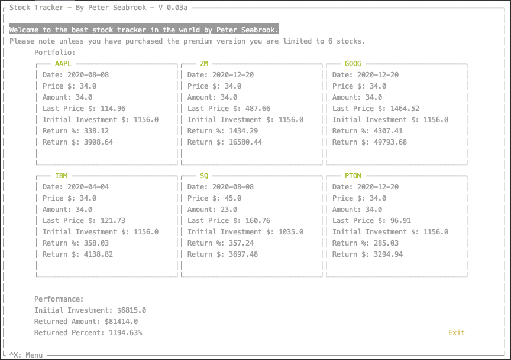

# Stock Portfolio Tracker



## Description
Welcome to the greatest terminal stock tracker ever made!

It utilises AlphaVantage to get end of day data to 
calculate the metrics. Get your free key from here: https://www.alphavantage.co/support/#api-key

If you are using a free API key it will wait 60 
seconds before pulling more data to avoid errors in 
your data collection.

Currently only supports stocks listed on US exhanges(NASDAQ, NYSE, AMEX).

The terminal GUI is built on top of npyscreen framework created by Nicholas Cole https://github.com/npcole/npyscreen.
Great framework to work with, I hope he releases more future updates.

If you ask nicely I may add in your beloved crypto markets too =)

## Workflow
Current workflow is setup to push through GitHub Actions CI/CD pipeline to and Amazon EC2 instance for deployment.
The pipeline looks like this:

Development machine -> Flake8/Mypy -> GitHub -> Automated testing -> Push to master -> Deploy & run on EC2

## Installation
#### Dependencies
* autopep8==1.5.4
* certifi==2020.6.20
* chardet==3.0.4
* flake8==3.8.3
* idna==2.10
* importlib-metadata==2.0.0
* mccabe==0.6.1
* npyscreen==4.10.5
* pycodestyle==2.6.0
* pyflakes==2.2.0
* requests==2.24.0
* termcolor==1.1.0
* toml==0.10.1
* urllib3==1.25.10
* zipp==3.2.0

#### Setup & Run

Set up your desired method of python virtual environment.
Activate your environment and run the following:
```
pip install -r requirements.txt
```
Export your api key IE:
```
export API_KEY=IUGURH&3894F
```
From root directory:
```
python src/main.py
```
#### First Run
Your terminal screen will need to be certain size for it to run(122w x 32h) derived as 
lines x columns. Or you can just open it in a full screen window and resize to 
the appropriate height.

You will be asked to open the menu and add a stock to track. This can be done using 
^X(CTRL + X) to open the main menu. Select Add stock by pressing 1 or Enter on the 
menu item. Fill in the form and it will return the stock and update the portfolio if 
the provided symbol is valid

Once your first lot of stocks are in you can then run the 
update function whenever you want to get the latest end of day 
pricing and recalculation of your portfolio holdings.
#### Usage
The menu can be activated from the main menu using ^X(CTRL+X).
Navigating through the menu's you can either press enter on the desired selection, press the corresponding 
number or click to select and enter to proceed, clicking will work with all elements as well to select them.

## Release History

* 0.2.6
    * CHANGE: Refactoring to be more modular between GUI and class's.
    * ADD: About page.
* 0.2.4
    * CHANGE: Docstring formatting.
    * ADD: Tests for verification.
* 0.2.2
    * FIX: Added a little solution to run even if the terminal height and width isn't right.
    You will just need to resize it out instead.
* 0.2.1
    * CHANGE: Update docs to reflect GUI addition.
* 0.2.0
    * CHANGE: Text based GUI goodness team!
    * CHANGE: Full refactoring of functions so all data is handled ouside GUI addition.
    Functions and class methods are standalone testable impartial to GUI.
* 0.1.9
    * ADD: Performance metrics for all stocks and overall portfolio.
* 0.1.7
    * ADD: Automated testing and CI/CD pipeline for all functions.
* 0.1.6
    * ADD: Delete stock function.
* 0.1.4
    * ADD: Update stocks function. Iterate through and update all stocks.
* 0.1.1
    * FIX: Added 60 second sleep function when adding more than 5 stocks as AV
    only lets you execute 5 calls per minute.
* 0.1.0
    * First major working release.
    * You can now save your portfolio to json format to recall later on.
    * Saving and loading features added, menu system added as well.
* 0.0.1
    * Basic terminal app that will display pulled stocks from Alpha Vantage API.


### Future Features

- Save to PDF
- Add colour
- About page
- Pagination for bigger portfolio
- Update tracking, if user already updated today, then don't update(NYC time after 4pm)
- Threading to pass off updating stocks in background

